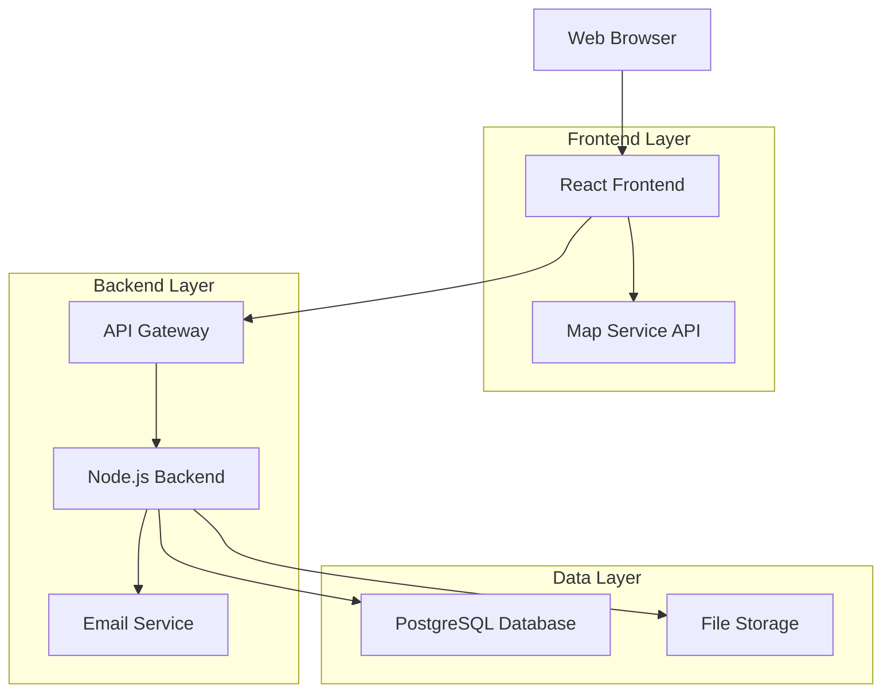

# CrimeGuard Website Design Document

## Overview

CrimeGuard is a modern, responsive web application built to facilitate community-driven crime reporting and safety awareness. The platform combines intuitive user interfaces with robust data management to create a comprehensive safety resource for communities and law enforcement agencies.

The system follows a client-server architecture with a React-based frontend, Node.js backend API, and integrated mapping services to provide real-time crime visualization and reporting capabilities.

## Architecture

### System Architecture



### Technology Stack

**Frontend:**
- React 18 with TypeScript
- Tailwind CSS for styling
- React Router for navigation
- Leaflet.js for interactive maps
- Axios for API communication
- React Hook Form for form management

**Backend:**
- Node.js with Express.js
- TypeScript for type safety
- JWT for authentication
- Bcrypt for password hashing
- Multer for file uploads
- Rate limiting middleware

**Database:**
- PostgreSQL for primary data storage
- Redis for session management and caching

**External Services:**
- OpenStreetMap/Mapbox for mapping
- SendGrid for email notifications
- Cloudinary for image storage

## Components and Interfaces

### Frontend Components

#### Core Layout Components
- **Header**: Navigation, logo, emergency contacts quick access
- **Footer**: Links, contact information, legal notices
- **Sidebar**: Filter controls for map and data views
- **LoadingSpinner**: Consistent loading states across the app

#### Feature Components
- **ReportForm**: Multi-step incident reporting interface
- **CrimeMap**: Interactive map with incident markers and filters
- **IncidentCard**: Display component for individual incident details
- **SafetyResources**: Organized display of safety information and contacts
- **AdminDashboard**: Administrative interface for content management
- **StatsDashboard**: Crime statistics and trend visualization

#### UI Components
- **Button**: Consistent button styling with variants
- **Modal**: Reusable modal component for forms and confirmations
- **FilterPanel**: Advanced filtering interface for map and data
- **SearchBar**: Global search functionality
- **AlertBanner**: System notifications and emergency alerts

### API Endpoints

#### Public Endpoints
```
GET /api/incidents - Retrieve filtered incident data
GET /api/incidents/map - Get incidents formatted for map display
GET /api/safety-resources - Fetch safety information and contacts
POST /api/incidents/report - Submit new incident report
GET /api/stats/public - Public crime statistics
```

#### Admin Endpoints
```
POST /api/auth/login - Admin authentication
GET /api/admin/incidents - Get all incidents for review
PUT /api/admin/incidents/:id - Update incident status
DELETE /api/admin/incidents/:id - Remove incident
POST /api/admin/safety-resources - Create/update safety content
GET /api/admin/analytics - System usage analytics
```

## Data Models

### Incident Model
```typescript
interface Incident {
  id: string;
  type: 'theft' | 'assault' | 'vandalism' | 'fraud' | 'other';
  description: string;
  location: {
    latitude: number;
    longitude: number;
    address: string;
    approximate: boolean;
  };
  datetime: Date;
  status: 'pending' | 'approved' | 'rejected';
  reporterContact?: string;
  severity: 'low' | 'medium' | 'high';
  createdAt: Date;
  updatedAt: Date;
}
```

### Safety Resource Model
```typescript
interface SafetyResource {
  id: string;
  title: string;
  content: string;
  category: 'emergency' | 'prevention' | 'contacts' | 'tips';
  priority: number;
  isActive: boolean;
  createdAt: Date;
  updatedAt: Date;
}
```

### Admin User Model
```typescript
interface AdminUser {
  id: string;
  username: string;
  email: string;
  passwordHash: string;
  role: 'admin' | 'moderator';
  lastLogin: Date;
  createdAt: Date;
}
```

## Error Handling

### Frontend Error Handling
- **Network Errors**: Display user-friendly messages with retry options
- **Validation Errors**: Real-time form validation with clear error messages
- **404 Errors**: Custom not found page with navigation options
- **500 Errors**: Generic error page with support contact information

### Backend Error Handling
- **Input Validation**: Comprehensive validation using Joi or similar
- **Database Errors**: Proper error logging with sanitized user messages
- **Authentication Errors**: Secure error responses without information leakage
- **Rate Limiting**: Clear messages when limits are exceeded

### Error Response Format
```typescript
interface ErrorResponse {
  success: false;
  error: {
    code: string;
    message: string;
    details?: any;
  };
  timestamp: string;
}
```

## Security Considerations

### Data Protection
- Input sanitization to prevent XSS attacks
- SQL injection prevention through parameterized queries
- CSRF protection with tokens
- Rate limiting on all public endpoints
- Secure headers (HSTS, CSP, etc.)

### Privacy Protection
- Location approximation for public incident display
- Optional anonymous reporting
- Data retention policies for incident reports
- GDPR compliance for user data handling

### Authentication & Authorization
- JWT-based admin authentication
- Role-based access control for admin functions
- Session timeout and refresh mechanisms
- Secure password requirements and hashing

## Testing Strategy

### Unit Testing
- Component testing with React Testing Library
- API endpoint testing with Jest and Supertest
- Database model validation testing
- Utility function testing

### Integration Testing
- API integration tests for complete workflows
- Database integration testing
- External service integration testing (maps, email)

### End-to-End Testing
- Critical user journeys with Cypress
- Cross-browser compatibility testing
- Mobile responsiveness testing
- Performance testing under load

### Testing Coverage Goals
- Minimum 80% code coverage for backend API
- Component testing for all interactive frontend elements
- Integration testing for all critical user workflows

## Performance Optimization

### Frontend Optimization
- Code splitting and lazy loading for route components
- Image optimization and lazy loading
- Caching strategies for static resources
- Bundle size optimization

### Backend Optimization
- Database query optimization with proper indexing
- API response caching for frequently requested data
- Connection pooling for database connections
- Compression middleware for API responses

### Monitoring and Analytics
- Performance monitoring with application metrics
- Error tracking and logging
- User analytics for feature usage
- Database performance monitoring